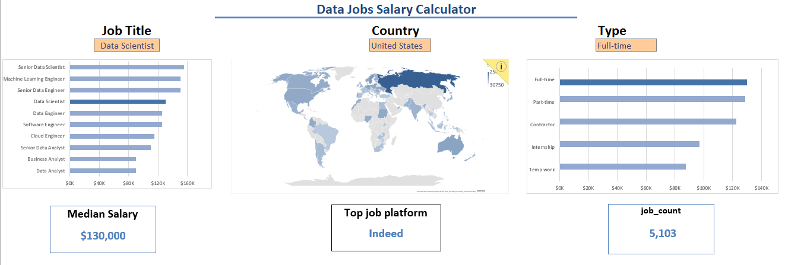
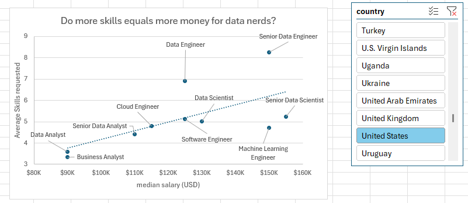
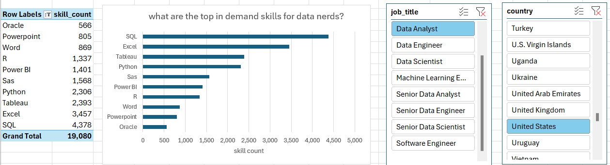
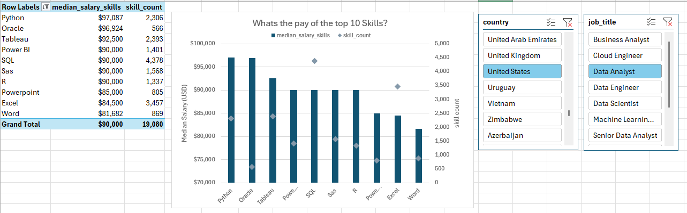

# Excel Salary Dashboard



## Introduction

This data jobs salary dashboard was created to help job seekers investigate salaries for their desired jobs and ensure they are being adequately compensated. 

The data is from a job searching app [Datanerd.tech](https://www.youtube.com/redirect?event=video_description&redir_token=QUFFLUhqbVlNU3ZNQlZmWHdnVWZUdk1mVWFNWncxU0ZRUXxBQ3Jtc0tscUxTUllFM3ltbGJ2S1RFejBuVE9XZE4zUUFWUG16UDBXNmxXbHE4LXdKZ0EyVGQwaHpGcnROZWVYNDhDSUt3VWVSbHRfMXJQX1gteUw5dkRmVWFpVzhjdkJaX21pdVdTbm5WNjVRcmFPd1VheTRlSQ&q=https%3A%2F%2Fdatanerd.tech%2F&v=mE6AbbllXr8). The data contains detailed information on job titles, salaries, locations, and essential skills that are presented here.  


### Excel Skills Used

The following Excel skills were utilized for analysis:

- **📉 Charts**
- **🧮 Formulas and Functions**
- **❎ Data Validation**

### Data Jobs Dataset

The dataset used for this project contains real-world data science job information from 2023. It includes detailed information on:

- **👨‍💼 Job titles**
- **💰 Salaries**
- **📍 Locations**
- **🛠️ Skills**

## Dashboard Build

### 📉 Charts

#### 📊 Data Science Job Salaries - Bar Chart  

- 🛠️ **Excel Features:** Utilized bar chart feature (with formatted salary values) and optimized layout for clarity.
- 🎨 **Design Choice:** Horizontal bar chart for visual comparison of median salaries.
- 📉 **Data Organization:** Sorted job titles by descending salary for improved readability.
- 💡 **Insights Gained:** This enables quick identification of salary trends, noting that Senior roles and Engineers are higher-paying than Analyst roles.

#### 🗺️ Country Median Salaries - Map Chart  

- 🛠️ **Excel Features:** Utilized Excel's map chart feature to plot median salaries globally.
- 🎨 **Design Choice:** Color-coded map to visually differentiate salary levels across regions.
- 📊 **Data Representation:** Plotted median salary for each country with available data.
- 👁️ **Visual Enhancement:** Improved readability and immediate understanding of geographic salary trends.
- 💡 **Insights Gained:** Enables quick grasp of global salary disparities and highlights high/low salary regions.

### 🧮 Formulas and Functions

#### 💰 Median Salary by Job Titles

```
=MEDIAN(
IF(
    (jobs[job_title_short]=A2)*
    (jobs[job_country]=country)*
    (ISNUMBER(SEARCH(type,jobs[job_schedule_type])))*
    (jobs[salary_year_avg]<>0),
    jobs[salary_year_avg]
)
)
```

- 🔍 **Multi-Criteria Filtering:** Checks job title, country, schedule type, and excludes blank salaries.
- 📊 **Array Formula:** Utilizes `MEDIAN()` function with nested `IF()` statement to analyze an array.
- 🎯 **Tailored Insights:** Provides specific salary information for job titles, regions, and schedule types.
- **🔢 Formula Purpose:** This formula populates the table below, returning the median salary based on job title, country, and type specified.

#### ⏰ Count of Job Schedule Type

```
=FILTER(J2#,(NOT(ISNUMBER(SEARCH("and",J2#))+ISNUMBER(SEARCH(",",J2#))))*(J2#<>0))
```

- 🔍 **Unique List Generation:** This Excel formula below employs the `FILTER()` function to exclude entries containing "and" or commas, and omit zero values.
- **🔢 Formula Purpose:** This formula populates the table below, which gives us a list of unique job schedule types.

### ❎ Data Validation

#### 🔍 Filtered List

- 🔒 **Enhanced Data Validation:** Implementing the filtered list as a data validation rule under the `Job Title`, `Country`, and `Type` option in the Data tab ensures:
    - 🎯 User input is restricted to predefined, validated schedule types
    - 🚫 Incorrect or inconsistent entries are prevented
    - 👥 Overall usability of the dashboard is enhanced


## Conclusion

I created this dashboard to showcase insights into salary trends across various data-related job titles. Utilizing data from the job app, this dashboard allows users to make informed decisions about their career paths. Exploring the functionalities to understand how location, job type and job schedule type influence salaries. [Checkout my work here](https://github.com/PhilTheAnalyst/Excel_data_analytics_projects/blob/main/Project_1.xlsx)  

# Project 2 Salary Analysis

## Introduction

As a former job seeker, I’ve always been surprised by the lack of data exploring the most optimal jobs and skills in the data science market. I set out to understand what skills top employers request and how to land more pay.

### Questions to Analyze

To understand the data science job market, I asked the following:

1. **Do more skills get you better pay?**
2. **What’s the salary for data jobs in different regions?**
3. **What are the top skills of data professionals?**
4. **What’s the pay for the top 10 skills?**

### Excel Skills Used

The following Excel skills were utilized for analysis:

- **📊 Pivot Tables**
- **📈 Pivot Charts**
- **🧮 DAX (Data Analysis Expressions)**
- **🔍 Power Query**
- **💪 Power Pivot**

### Data Jobs Dataset

The dataset used for this project contains real-world data science job information from 2023. The dataset is available at [Datanerd.tech](https://www.youtube.com/redirect?event=video_description&redir_token=QUFFLUhqbVlNU3ZNQlZmWHdnVWZUdk1mVWFNWncxU0ZRUXxBQ3Jtc0tscUxTUllFM3ltbGJ2S1RFejBuVE9XZE4zUUFWUG16UDBXNmxXbHE4LXdKZ0EyVGQwaHpGcnROZWVYNDhDSUt3VWVSbHRfMXJQX1gteUw5dkRmVWFpVzhjdkJaX21pdVdTbm5WNjVRcmFPd1VheTRlSQ&q=https%3A%2F%2Fdatanerd.tech%2F&v=mE6AbbllXr8) , which provides a foundation for analyzing data using Excel. 

It includes detailed information on:

- **👨‍💼 Job titles**
- **💰 Salaries**
- **📍 Locations**
- **🛠️ Skills**

## 1️⃣ Do more skills get you better pay?

### 🔍 Skill: Power Query (ETL)

#### 📥 Extract

- I first used Power Query to extract the original data (`data_salary_all.xlsx`) and create two queries:
    - 🗃️ First one with all the data jobs information.
    - 🔧 The second listing the skills for each job ID.

#### 🔄 Transform

- Then, I transformed each query by changing column types, removing unnecessary columns, cleaning text to eliminate specific words, and trimming excess whitespace.

#### 🔗 Load

- Finally, I loaded both transformed queries into the workbook, setting the foundation for my subsequent analysis.


### 📊 Analysis

#### 💡 Insights

- 📈 There is a positive correlation between the number of skills requested in job postings and the median salary, particularly in roles like Senior Data Engineer and Data Scientist.
- 💼 Roles that require fewer skills, like Business Analyst, tend to offer lower salaries, suggesting that more specialized skill sets command higher market value.

    

#### 🤔 So What

- This trend emphasizes the value of acquiring multiple relevant skills, particularly for individuals aiming for higher-paying roles.

## 2️⃣ What’s the salary for data jobs in different regions?

### 🧮 Skills: PivotTables & DAX

#### 📈Pivot Table

- 🔢 I created a PivotTable using the Data Model I created with Power Pivot.
- 📊 I moved the `job_title_short` to the rows area and `salary_year_avg` into the values area.
- 🧮 Then I added new measure to calculate the median salary for United States jobs.
    ```
    =CALCULATE(
        MEDIAN(data_jobs_all[salary_year_avg]),
        data_jobs_all[job_country] = "United States")
    ```

#### 🧮 DAX

- To calculate the median year salary I used DAX.

    ```
    Median Salary := MEDIAN(data_jobs_all[salary_year_avg])
    ```

### 📊 Analysis

#### 💡 Insights

- 💼 Job roles like Senior Data Engineer and Data Scientist command higher median salaries both in the US and internationally, showcasing the global demand for high-level data expertise.
- 💰 The salary disparity between US and Non-US roles is particularly notable in high-tech jobs, which might be influenced by the concentration of tech industries in the US.

    

#### **🤔 So What**

- These salary insights are important for planning and salary negotiations, helping professionals and companies align their offers with market standards while considering geographical variations.

## 3️⃣ What are the top skills of data professionals?

### 🔧 Skill: Power Pivot

#### 💪 Power Pivot

- 🔗 I created a data model by integrating the `data_jobs_all` and `data_jobs_skills` tables into one model.
- 🧹 Since I had already cleaned the data using Power Query; Power Pivot created a relationship between these two tables.

#### 🔗 Data Model

- I created a relationship between my two tables using the `job_id` column.  

#### 📃 Power Pivot Menu

- The Power Pivot menu was used to refine my data model and makes it easy to create measures.

### 📊Analysis

#### 💡Insights

- 💻 SQL and Python dominate as top skills in data-related jobs, reflecting their foundational role in data processing and analysis.
- ☁️ Emerging technologies like AWS and Azure also show significant presence, underlining the industry's shift towards cloud services and big data technologies.

    

#### 🤔So What

- Understanding prevalent skills in the industry not only helps professionals stay competitive but also guides training and educational programs to focus on the most impactful technologies.

## 4️⃣ What’s the pay of the top 10 skills?

### 📊 Skill: Advanced Charts (Pivot Chart)

#### 📈 PivotChart

- I created a combo PivotChart to plot median salary and skill likelihood (%) from my PivotTable.
    - 🪙 **Primary Axis:** Median Salary (as a Clustered Column)
    - 👍 **Secondary Axis:** Skill Likelihood (as a Line with Markers)
- To customize the chart, I added a title axis title, removed the lines (skill likelihood), and changed the markers to diamonds.

### 📊 Analysis

#### 💡Insights

- 💰 Higher median salaries are associated with skills like Python, Oracle, and SQL, suggesting their critical role in high-paying tech jobs.
- 📉 Skills like PowerPoint and Word have the lowest median salaries and likelihood, indicating less specialization and demand in high-salary sectors.

    

### 🤔So What

- This chart highlights the importance of investing time in learning high-value skills like Python and SQL, which are evidently tied to higher paying roles, especially for those looking to maximize their salary in the tech industry.

## Conclusion

As a data enthusiast and former job seeker, I embarked on this Excel-based project to uncover valuable insights about the data science job market. I analyzed job titles, salaries, locations, and essential skills. By leveraging Excel features like Power Query, PivotTables, DAX, and charts, I discovered key correlations between multiple skills and higher salaries, particularly in Python, SQL, and cloud technologies. 

I hope this project serves as a practical guide for data professionals and provides an overview of the skills needed for higher-paying roles.  
[Checkout my work here](https://github.com/PhilTheAnalyst/Excel_data_analytics_projects/blob/main/project_2.xlsx)