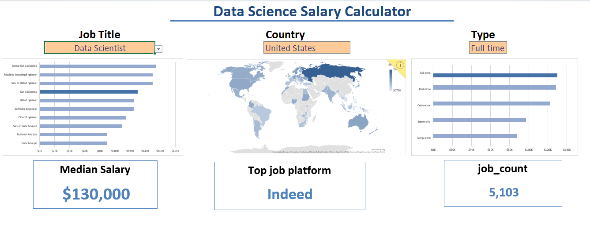
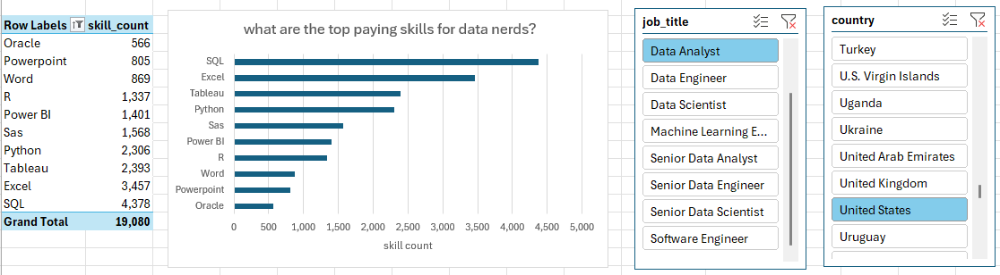
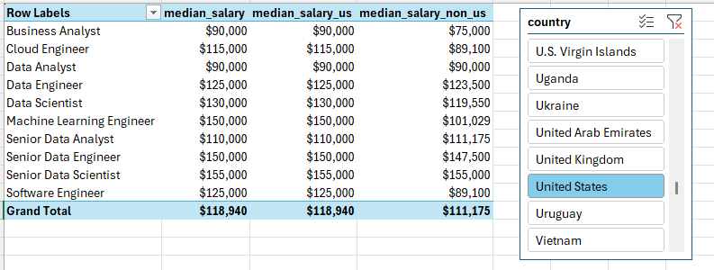

# Excel_data_analytics_projects
This repo contains all the Excel files need to follow along my projects: [Excel for data analytics](https://github.com/PhilTheAnalyst/Excel_data_analytics_projects). Special thanks to Luke barousse for providing  the learning material as well as the datasets do to the project.
## 1. Salary Dashboard  
This data jobs salary dashboard was created to help job seekers investigate salaries for their desired jobs and ensure they are been adequately compensated.
[Checkout my work here](https://github.com/PhilTheAnalyst/Excel_data_analytics_projects/blob/main/Project_1.xlsx)  
  
## 2. Salary Analysis  
As a former job seeker, ave always been surprised by the lack of data exploring the most optimal job and skills in the data science market. I set to understand what skills do top employers request and how to land more pay. [Checkout my work here](https://github.com/PhilTheAnalyst/Excel_data_analytics_projects/blob/main/project_2.xlsx) 
### Skill job Analysis  
  
Here i was investigating, what are the top ten paying skills for data nerds, based on skill count. Then added two filters one for thr job title and another for the country.
### Salary vs Skill
  
Here i was asking the question," Do more skills equate to more money for data nerds?". Then added a country filter slicer to investigate further for individual countries. This analysis was based on median salaries. 
### Salary Analysis

On this analysis, i sought to compare the median salaries for different jobs in the US vs Non US countries.

### Skill Salary Analysis
  
On this final analysis, i was investigating the pay of the top ten skills for data nerds and their associated skill count. This analysis was based on the median salaries. The final touch was adding a country and job title slicer to further give more insights.

